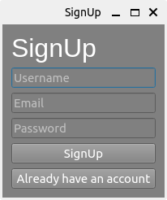
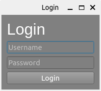

# PyQt5 Login and SignUp Application

This is a simple desktop application built using PyQt5 that allows users to sign up and login.

## Features

- Sign up with a username, email, and password.
- Login with username and password.
- User-friendly interface with styled widgets.

## Prerequisites

Make sure you have Python 3.x installed on your system. You can download it from [python.org](https://www.python.org/).

Install PyQt5 using pip:

```bash
pip install PyQt5
```

## Usage

1. Clone or download this repository to your local machine.
2. Navigate to the project directory.
3. Run the main.py file using Python:

```bash
python main.py
```

## Screenshots

Below are screenshots of the application's SignUp and Login windows:

### SignUp Window


### Login Window



## Contributing

Contributions are welcome! If you'd like to contribute to this project, please fork the repository and submit a pull request.

