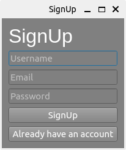
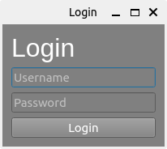

# PySide Desktop Application - Login/Signup

This is a simple desktop application built using PySide2, allowing users to sign up and log in. It provides a graphical user interface for managing user authentication and access.

## Features

- **User Sign Up**: Users can create a new account by providing a username, email, and password. The application validates the input data and ensures that the username and email are unique.
- **User Login**: Registered users can log in to their accounts using their username and password. The application verifies the login credentials against the stored user data.
- **Responsive GUI**: The application provides an intuitive and responsive graphical user interface (GUI) that adapts to various screen sizes and resolutions.

## Requirements

- **Python 3**: Make sure you have Python 3 installed on your system. You can download and install it from [Python's official website](https://www.python.org/).
- **PySide2 library**: Install the PySide2 library, which provides Python bindings for the Qt framework used to build the GUI. You can install it using pip:

    ```bash
    pip install PySide2
    ```


## Usage

Run the `main.py` script to launch the application:

```bash
python main.py
```


## Screenshots

Below are screenshots of the application's SignUp and Login windows:

### SignUp Window


### Login Window



## Contributing

Contributions are welcome! If you have suggestions for improving the application or want to report a bug, please open an issue or submit a pull request.

