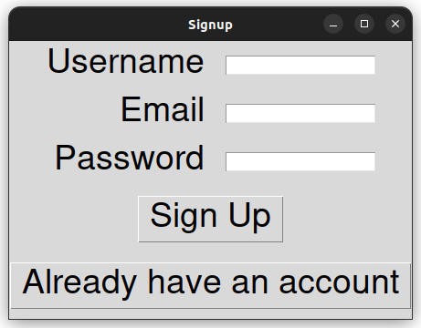
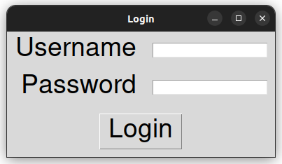

# Creating a SignUp and Login Application with Tkinter

In this Python script, we're building a simple SignUp and Login application using the Tkinter library, perfect for beginners dipping their toes into GUI programming.

## Overview

Our application consists of two primary windows: **SignUp** and **Login**.

### SignUp Window
- This window welcomes new users and prompts them to create an account.
- Users need to provide a username, email, and password.
- Once they hit the "Sign Up" button, a message pops up, confirming their successful registration.

### Login Window
- For returning users, the Login window awaits.
- Here, they're prompted to enter their username and password.
- Not to worry if they haven't signed up yet; they can switch back to SignUp seamlessly with the provided button.
- After entering their credentials and hitting "Login," they're greeted with a message, either confirming their successful login or indicating an error with their details.

## Execution

Want to see this app in action? Follow these steps:

1. **Prep Your Environment**: Make sure you have Python installed on your system.
2. **Get the Code**: Copy the provided Python code into a file, naming it something like `signup_login.py`.
3. **Run the Script**: Fire up your terminal or command prompt, navigate to the directory containing the script, and execute it by typing `python signup_login.py`.
4. **Interact**: Once the SignUp window pops up, dive in! Input your details, switch to Login to test it out, and marvel at how it all works seamlessly.

## Sneak Peek Image

Curious to see how the application looks? Check out this snapshot:
 

 <strong>Signup Window</strong>  

 

 <strong>Login Window</strong>  

